# Nutrition Facts Vision App

<div align="center">


**An intelligent mobile application that scans food labels and provides health risk analysis**

[Features](#features) • [Tech Stack](#tech-stack) • [Installation](#installation) • [Screenshots](#screenshots)

</div>

---

## About the Project

Nutrition Facts Vision App is a Flutter mobile application that enables users to scan food labels using their device camera and receive health risk analysis based on the ingredients listed. The app combines OCR (Optical Character Recognition) using Google ML Kit with AI-powered analysis through OpenAI's GPT-5-mini model to provide comprehensive nutritional insights.

## Features

- **User Authentication**: Email/Password registration and login with Firebase
- **Profile Management**: User information and settings management
- **Home Screen**: History of previous scans and quick access
- **Label Scanning**: Scan food labels using the device camera
- **OCR Recognition**: Automatic text extraction using Google ML Kit
- **Analysis Screen**: Risk levels and detailed summaries
- **Health Risk Analysis**: Ingredient-based risk assessment
- **AI-Powered Insights**: Detailed analysis using OpenAI GPT
- **Multi-Language Support**: Turkish and English interface

## Tech Stack

| Category             | Technology                     |
| -------------------- | ------------------------------ |
| **Frontend**         | Flutter 3.x, Dart 3.8+         |
| **State Management** | Riverpod 2.6.1                 |
| **Authentication**   | Firebase Authentication        |
| **OCR**              | Google ML Kit Text Recognition |
| **Backend**          | FastAPI                        |
| **Database**         | PostgreSQL                     |
| **AI/LLM**           | OpenAI GPT-5-mini              |
| **Localization**     | Flutter Localizations (ARB)    |
| **HTTP Client**      | http 1.4.0                     |
| **Media Picker**     | image_picker 1.1.2             |

## Screenshots

### Authentication Flow

|                        Sign In                         |                     Sign Up                     |
| :----------------------------------------------------: | :---------------------------------------------: |
| 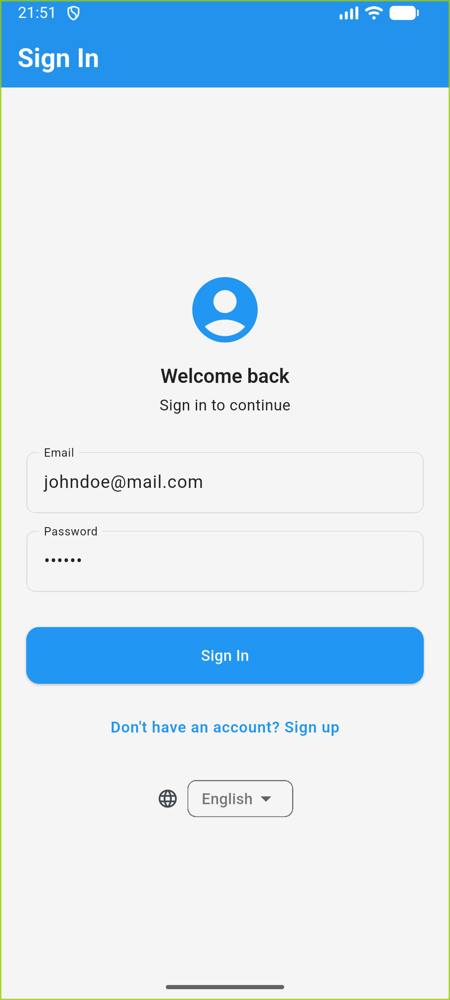 | 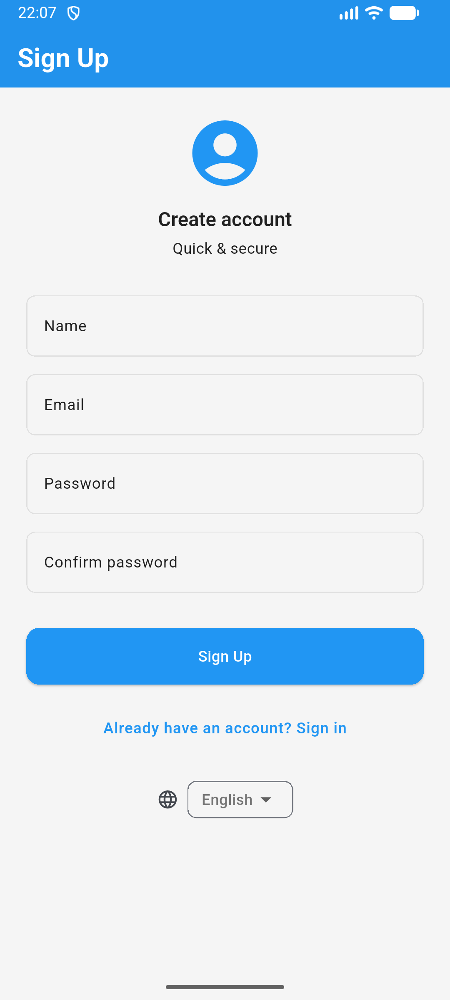 |

### Profile Setup Process

|                          Step 1                          |                          Step 2                          |                          Step 3                          |
| :------------------------------------------------------: | :------------------------------------------------------: | :------------------------------------------------------: |
| 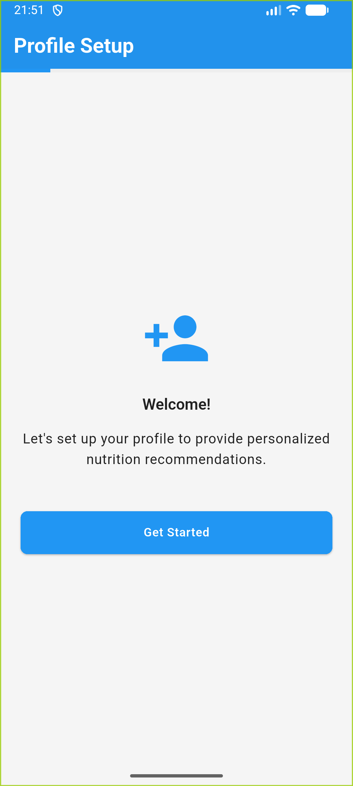 | 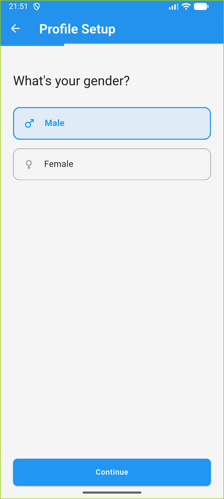 | 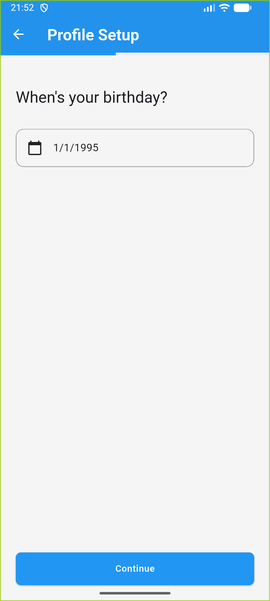 |

|                          Step 4                          |                          Step 5                          |                          Step 6                          |
| :------------------------------------------------------: | :------------------------------------------------------: | :------------------------------------------------------: |
|  | 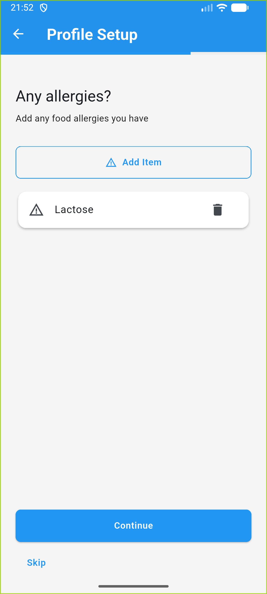 | 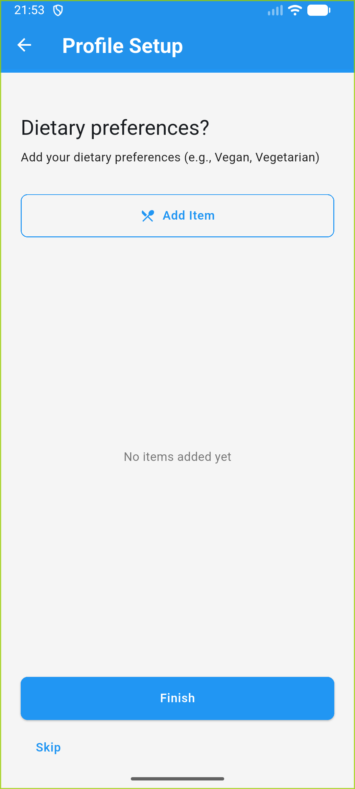 |

### Main Application Overview

|                     Home Screen                      |                     Profile Screen                      |
| :--------------------------------------------------: | :-----------------------------------------------------: |
| 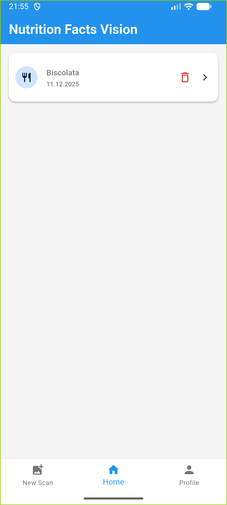 | 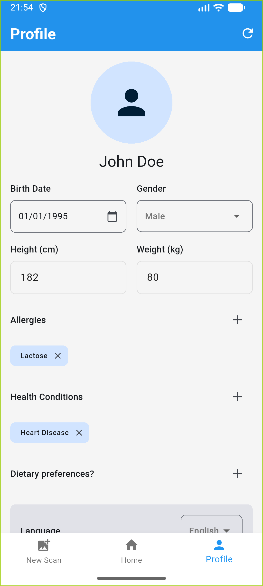 |

### Label Scanning and Analysis

|                       Scan Screen                        |                             Scan Example                              |
| :------------------------------------------------------: | :-------------------------------------------------------------------: |
| 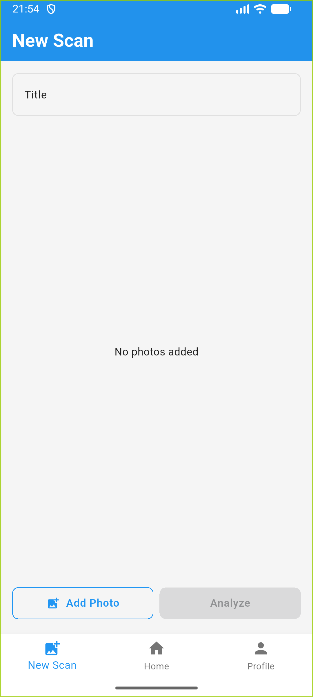 | 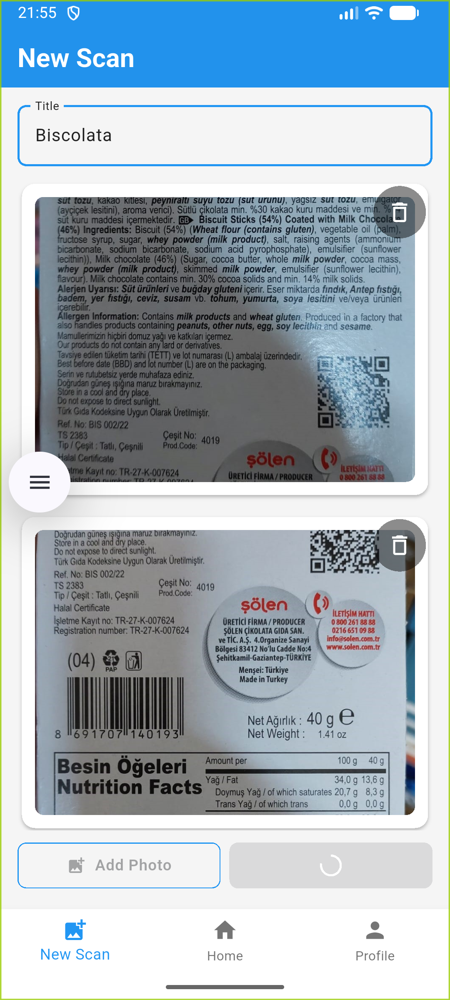 |

### Detailed Analysis Results

|                               Overview Tab                               |                               Ask AI Tab                               |
| :----------------------------------------------------------------------: | :--------------------------------------------------------------------: |
| 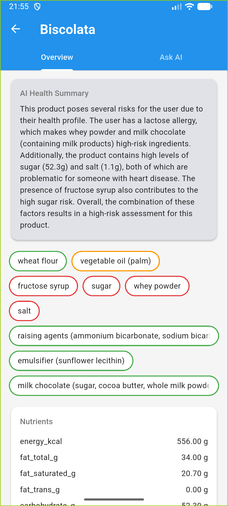 | 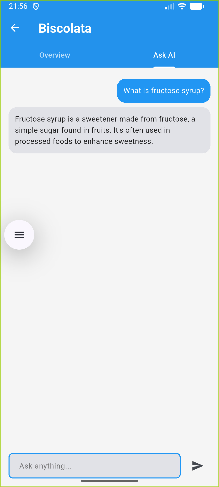 |

## Project Structure

```
lib/
├── main.dart                    # Application entry point
├── app.dart                     # App configuration
├── firebase_options.dart        # Firebase setup
├── core/                        # Core components
│   ├── localization/           # Multi-language support
│   ├── navigation/             # Route management
│   ├── theme/                  # Themes and styling
│   └── utils/                  # Helper functions
└── features/                    # Application features
    ├── auth/                   # Authentication
    ├── home/                   # Home screen
    ├── profile/                # Profile management
    ├── profile_setup/          # Profile setup
    ├── scan/                   # Label scanning
    └── analysis/               # Analysis results
```

## Installation

### Prerequisites

- Flutter SDK 3.x
- Dart 3.8+
- Firebase project
- OpenAI API key
- FastAPI backend service

### Steps

1. **Clone the repository**

   ```bash
   git clone <repository-url>
   cd nutrition-facts-vision-app
   ```

2. **Install dependencies**

   ```bash
   flutter pub get
   ```

3. **Generate localization files**

   ```bash
   flutter gen-l10n
   ```

4. **Configure Firebase**

   - Create a new project in Firebase Console
   - Add `google-services.json` (Android) and `GoogleService-Info.plist` (iOS)

5. **Set up environment variables**

   - Configure OpenAI API key
   - Set FastAPI backend URL

6. **Run the application**
   ```bash
   flutter run
   ```

## Key Features in Detail

### Authentication

Secure user registration and login using Firebase Authentication with email/password method.

### Label Scanning

Automatically extracts text from food labels using Google ML Kit Text Recognition for accurate OCR.

### AI Analysis

Evaluates ingredient health impacts using OpenAI's GPT-5-mini model for comprehensive risk assessment.

### Scan History

All scans are stored in PostgreSQL database and accessible to users for future reference.

### Multi-Language Support

Full support for Turkish and English interfaces using ARB localization files.

## License

This project is licensed under the MIT License - see the LICENSE file for details.

## Author

Developed by Ziya Kolcu

## Contributing

Contributions are welcome! Please feel free to submit a Pull Request.

## Contact

For questions or suggestions, please contact the development team.

---

<div align="center">

Made with Flutter

</div>
